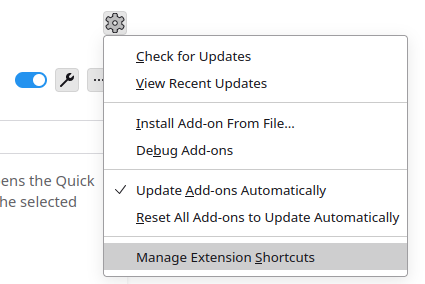

# Thunderbird extension quickfilter-kbd

## About

A simple Thunderbird extension that adds keyboard shortcuts to quick-filter messages with the same sender, subject, or recipient as a selected message.

Selecting a message and pressing one of the following default key-combinations opens the Quick Filter toolbar and filters messages that share the following properties with the selected message
:

| Default Shortcut Key | Property             |
|----------------------|----------------------|
| Alt+Shift+A          | same author (sender) |
| Alt+Shift+S          | same subject         |
| Alt+Shift+R          | same recipient(s)    |

The default shortcut keys can be changed in the entry *Manage Extension Shortcuts* of the gear-icon-menu on the page of the add-on in the *Add-ons Manager* (see the screenshot below).



This extension is based on the sample extension [quick-filter](https://github.com/thunderbird/sample-extensions/tree/master/manifest_v3/quickfilter) from the official [sample-extensions](https://github.com/thunderbird/sample-extensions/) repository and can be easily modified by following the [official documentation](https://developer.thunderbird.net/add-ons/about-add-ons) for writing extensions.


## Installation

### From Thunderbird Add-Ons repository.

Install directly from the [Thunderbird Add-Ons repository](https://addons.thunderbird.net/de/thunderbird/addon/quickfilter-kbd/).

### From source

1. Create a zip archiv with the following content
   ```
    /
     ├── background.js
     └── manifest.json
   ```
   and rename it to `quickfilter-kbd.xpi`.

2. Open the *Add-ons Manager* in Thunderbird and use *Install Add-On From File...*.
